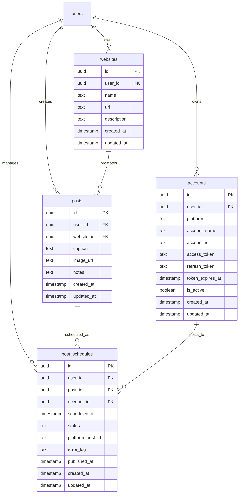

# ToolsLiguns Database Schema Documentation

## Overview
This database schema is designed to manage social media posting for up to 20+ websites with long-term scheduling capabilities (up to 1 year in advance).

## 📊 Database Structure

### Entity Relationship Diagram



## 📋 Table Descriptions

### 1. `websites`
Stores information about all websites you're promoting through social media.

**Columns:**
- `id` - Primary key (UUID)
- `user_id` - Reference to authenticated user (for multi-tenancy)
- `name` - Website name (e.g., "Liguns Entertainment")
- `url` - Website URL (e.g., "https://beraspolos.online")
- `description` - Optional description
- `created_at` - Timestamp when created
- `updated_at` - Auto-updated timestamp

**Use Case:** You can manage 20+ websites, each with their own social media presence.

---

### 2. `accounts`
Stores social media platform credentials and OAuth tokens.

**Columns:**
- `id` - Primary key (UUID)
- `user_id` - Reference to authenticated user
- `platform` - Platform type (facebook, instagram, linkedin, twitter, gmb, tiktok, youtube, pinterest)
- `account_name` - Display name (e.g., "@liguns")
- `account_id` - External platform ID
- `access_token` - OAuth access token (encrypted recommended)
- `refresh_token` - OAuth refresh token (optional)
- `token_expires_at` - When the token expires
- `is_active` - Whether this account is currently active
- `created_at` - Timestamp when created
- `updated_at` - Auto-updated timestamp

**Security Note:** 
> [!IMPORTANT]
> Consider using Supabase's `vault` for storing sensitive tokens in production.

**Constraints:**
- Unique constraint on `(user_id, platform, account_id)` to prevent duplicate accounts

---

### 3. `posts`
The content master containing all post data (caption, image, etc.).

**Columns:**
- `id` - Primary key (UUID)
- `user_id` - Reference to authenticated user
- `website_id` - Which website this post promotes (FK to websites)
- `caption` - Post text/caption
- `image_url` - Supabase Storage public URL or external URL
- `notes` - Internal notes (not posted publicly)
- `created_at` - Timestamp when created
- `updated_at` - Auto-updated timestamp

**Use Case:** Create a post once, schedule it to multiple platforms/accounts.

---

### 4. `post_schedules`
The execution queue that determines when and where posts are published.

**Columns:**
- `id` - Primary key (UUID)
- `user_id` - Reference to authenticated user
- `post_id` - Which post to publish (FK to posts)
- `account_id` - Which social account to use (FK to accounts)
- `scheduled_at` - When to publish (can be up to 1 year in future)
- `status` - Current status (QUEUED, PUBLISHED, FAILED, CANCELLED)
- `platform_post_id` - ID returned by the platform after posting
- `error_log` - Error message if posting failed
- `published_at` - Actual timestamp when published
- `created_at` - Timestamp when created
- `updated_at` - Auto-updated timestamp

**Status Flow:**
```
QUEUED → PUBLISHED (success)
       → FAILED (error)
       → CANCELLED (user cancelled)
```

**Indexes:**
- Composite index on `(status, scheduled_at)` for efficient queue processing
- Individual indexes on foreign keys for join performance

---

## 🔒 Row Level Security (RLS)

All tables have RLS enabled with the following policies:

| Table | Policy | Rule |
|-------|--------|------|
| All tables | SELECT | Users can only view their own data (`auth.uid() = user_id`) |
| All tables | INSERT | Users can only insert their own data |
| All tables | UPDATE | Users can only update their own data |
| All tables | DELETE | Users can only delete their own data |

**How it works:**
- Supabase automatically adds `user_id` filtering to all queries
- No need to manually add `WHERE user_id = ...` in your application code
- Multi-tenancy is enforced at the database level

---

## 📈 Helpful Views

### `upcoming_posts_view`
Shows all queued posts with full details (website, account, platform).

**Usage:**
```sql
SELECT * FROM upcoming_posts_view
WHERE scheduled_at >= NOW()
  AND scheduled_at <= NOW() + INTERVAL '7 days';
```

### `posts_by_website_view`
Analytics view showing post counts grouped by website.

**Usage:**
```sql
SELECT * FROM posts_by_website_view
ORDER BY total_posts DESC;
```

### `account_stats_view`
Statistics for each social media account.

**Usage:**
```sql
SELECT * FROM account_stats_view
WHERE is_active = TRUE
ORDER BY total_published DESC;
```

---

## 🚀 Setup Instructions

### Step 1: Run the SQL Script

1. Go to your Supabase project dashboard
2. Navigate to **SQL Editor**
3. Click **New query**
4. Copy and paste the contents of `supabase-schema.sql`
5. Click **Run** or press `Ctrl+Enter`

### Step 2: Verify Tables

```sql
-- Check if all tables were created
SELECT table_name 
FROM information_schema.tables 
WHERE table_schema = 'public' 
  AND table_name IN ('websites', 'accounts', 'posts', 'post_schedules');
```

### Step 3: Configure Storage (for images)

1. Go to **Storage** in Supabase dashboard
2. Create a new bucket called `post-images`
3. Set the bucket to **Public** (so images are accessible)
4. Add RLS policies if you need finer control

**Storage Policy Example:**
```sql
-- Allow authenticated users to upload images
CREATE POLICY "Users can upload their own images"
ON storage.objects FOR INSERT
WITH CHECK (
  bucket_id = 'post-images' 
  AND auth.role() = 'authenticated'
);

-- Allow public read access
CREATE POLICY "Public can view images"
ON storage.objects FOR SELECT
USING (bucket_id = 'post-images');
```

---

## 💡 Usage Examples

### Example 1: Create a Website
```sql
INSERT INTO websites (user_id, name, url, description)
VALUES (
  auth.uid(),
  'Beras Polos',
  'https://beraspolos.online',
  'Premium rice delivery service'
)
RETURNING *;
```

### Example 2: Add a Facebook Account
```sql
INSERT INTO accounts (user_id, platform, account_name, account_id, access_token, token_expires_at)
VALUES (
  auth.uid(),
  'facebook',
  'Beras Polos Official',
  'fb_1234567890',
  'EAAxxxxxxxxxxxxx',
  NOW() + INTERVAL '60 days'
)
RETURNING *;
```

### Example 3: Create a Post
```sql
INSERT INTO posts (user_id, website_id, caption, image_url)
VALUES (
  auth.uid(),
  '550e8400-e29b-41d4-a716-446655440000', -- website_id
  'Fresh organic rice delivered to your door! 🌾',
  'https://your-project.supabase.co/storage/v1/object/public/post-images/rice.jpg'
)
RETURNING *;
```

### Example 4: Schedule a Post
```sql
INSERT INTO post_schedules (user_id, post_id, account_id, scheduled_at, status)
VALUES (
  auth.uid(),
  '123e4567-e89b-12d3-a456-426614174000', -- post_id
  '789e0123-e89b-12d3-a456-426614174111', -- account_id
  '2026-02-01 10:00:00+07', -- Schedule for Feb 1, 2026
  'QUEUED'
)
RETURNING *;
```

### Example 5: Get All Queued Posts for Tomorrow
```sql
SELECT * FROM upcoming_posts_view
WHERE scheduled_at::date = (CURRENT_DATE + INTERVAL '1 day')
ORDER BY scheduled_at ASC;
```

### Example 6: Update Post Status After Publishing
```sql
UPDATE post_schedules
SET 
  status = 'PUBLISHED',
  platform_post_id = 'fb_post_987654321',
  published_at = NOW()
WHERE id = 'schedule-uuid-here'
  AND status = 'QUEUED';
```

---

## 🔄 Automation Strategy

### Option 1: Edge Functions (Recommended)
Create a Supabase Edge Function that runs every minute to check for queued posts.

```typescript
// supabase/functions/process-queue/index.ts
import { createClient } from '@supabase/supabase-js'

Deno.serve(async () => {
  const supabase = createClient(...)
  
  // Get posts scheduled for now or earlier
  const { data: schedules } = await supabase
    .from('post_schedules')
    .select('*, posts(*), accounts(*)')
    .eq('status', 'QUEUED')
    .lte('scheduled_at', new Date().toISOString())
    .limit(10)
  
  // Process each schedule
  for (const schedule of schedules) {
    try {
      // Post to social media using account.access_token
      const platformPostId = await postToSocialMedia(schedule)
      
      // Update status to PUBLISHED
      await supabase
        .from('post_schedules')
        .update({ 
          status: 'PUBLISHED', 
          platform_post_id: platformPostId,
          published_at: new Date().toISOString()
        })
        .eq('id', schedule.id)
    } catch (error) {
      // Update status to FAILED
      await supabase
        .from('post_schedules')
        .update({ 
          status: 'FAILED', 
          error_log: error.message 
        })
        .eq('id', schedule.id)
    }
  }
  
  return new Response('OK')
})
```

### Option 2: Cron Job
Set up a cron job using Supabase's cron extension or external service (Vercel Cron, GitHub Actions).

---

## 🎯 Next Steps

1. ✅ Run the SQL schema in Supabase SQL Editor
2. 📦 Configure Supabase Storage for images
3. 🔐 Set up authentication in your Next.js app
4. 🎨 Build the UI components for managing websites/posts
5. 🤖 Create Edge Functions for automated posting
6. 📊 Build analytics dashboard using the views

---

## 📚 TypeScript Types

Generate TypeScript types from your schema:

```bash
npx supabase gen types typescript --project-id your-project-id > src/types/database.types.ts
```

This will create type-safe interfaces for all your tables!

---

## ⚠️ Important Notes

> [!WARNING]
> **Token Security**: Store OAuth tokens securely. Consider using Supabase Vault for production.

> [!TIP]
> Use the composite index on `(status, scheduled_at)` to efficiently query the next batch of posts to publish.

> [!NOTE]
> The `updated_at` column is automatically maintained by database triggers. You don't need to update it manually.

---

## 🆘 Troubleshooting

**Issue: RLS policies blocking queries**
- Make sure you're authenticated before running queries
- Use `auth.uid()` in your application code to get the current user

**Issue: Foreign key constraint errors**
- Ensure the referenced records exist before creating relationships
- Check that `user_id` matches across related tables

**Issue: Token expiration**
- Implement a refresh token flow in your Edge Function
- Set up notifications when tokens are about to expire

---

## 📞 Support
For questions or issues, refer to:
- [Supabase Documentation](https://supabase.com/docs)
- [Supabase RLS Guide](https://supabase.com/docs/guides/auth/row-level-security)
- [Supabase Edge Functions](https://supabase.com/docs/guides/functions)
