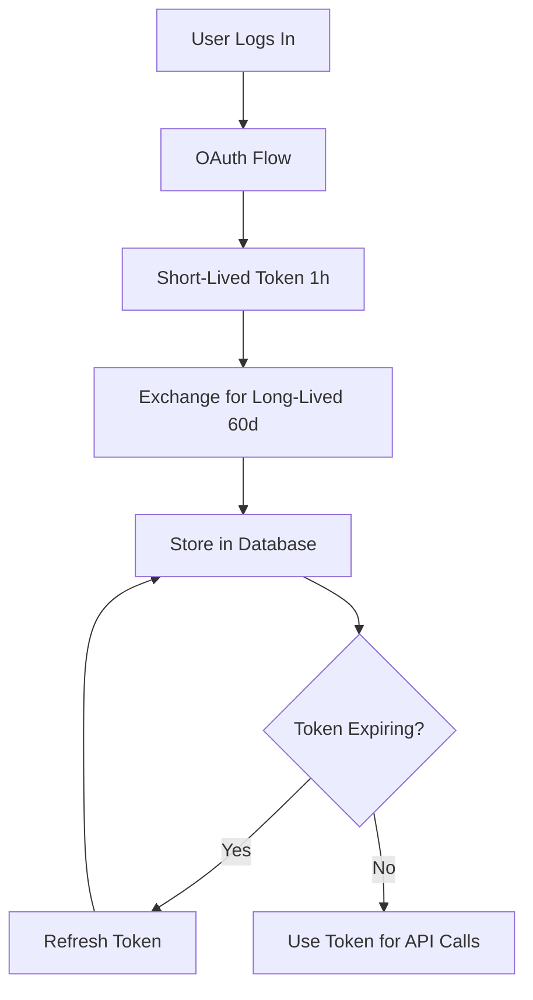

# 🔐 Meta (Facebook/Instagram) API Setup Guide

## Overview

This guide walks you through setting up Facebook/Instagram API integration for ToolsLiguns.

---

## 📋 Prerequisites

- Active Facebook account
- Business verification (for some features)
- Facebook Page (for Instagram Business)

---

## 🚀 Step-by-Step Setup

### 1. Create Facebook App

1. Go to **https://developers.facebook.com**
2. Click **"My Apps"** → **"Create App"**
3. Select **"Business"** as app type
4. Fill in:
   - **App Name**: ToolsLiguns
   - **App Contact Email**: your-email@example.com
   - **Business Account**: (optional, create if needed)
5. Click **"Create App"**

---

### 2. Get App Credentials

1. In App Dashboard, go to **Settings** → **Basic**
2. Copy your credentials:
   - **App ID**: `123456789012345`
   - **App Secret**: Click **"Show"** → Copy

3. Add to `.env.local`:
```bash
FACEBOOK_APP_ID=123456789012345
FACEBOOK_APP_SECRET=your-app-secret-here
```

⚠️ **IMPORTANT**: Never commit `.env.local` to Git!

---

### 3. Configure OAuth Redirect URIs

1. In App Dashboard, go to **Facebook Login** → **Settings**
2. Add **Valid OAuth Redirect URIs**:
   ```
   http://localhost:3000/api/auth/facebook/callback
   https://toolsliguns.vercel.app/api/auth/facebook/callback
   ```
3. Click **"Save Changes"**

---

### 4. Add Required Permissions

1. Go to **App Review** → **Permissions and Features**
2. Request these permissions:
   - ✅ `pages_show_list` - Read list of Pages
   - ✅ `pages_read_engagement` - Read Page data
   - ✅ `pages_manage_posts` - Publish to Pages
   - ✅ `instagram_basic` - Access Instagram accounts
   - ✅ `instagram_content_publish` - Publish to Instagram
   - ✅ `publish_to_groups` - (optional) Post to groups

3. Click **"Add"** for each permission

---

### 5. Enable Instagram Graph API

1. In App Dashboard, click **"Add Product"**
2. Find **"Instagram Graph API"**
3. Click **"Set Up"**
4. Follow prompts to connect Instagram Business Account

**Requirements:**
- Instagram account must be a **Business** or **Creator** account
- Must be linked to a **Facebook Page**

---

## 🧪 Testing

### Test Token Exchange

```typescript
import { exchangeForLongLivedToken } from '@/lib/meta-auth';

// After OAuth flow, exchange short-lived token
const result = await exchangeForLongLivedToken(shortLivedToken);
console.log('Long-lived token:', result.accessToken);
console.log('Expires at:', result.expiresAt);
```

### Test Fetch Accounts

```typescript
import { fetchConnectedAccounts } from '@/lib/meta-auth';

const accounts = await fetchConnectedAccounts(accessToken);
console.log('Connected accounts:', accounts);
```

---

## 📊 Token Lifecycle

### Short-Lived Token
- **Duration**: 1 hour
- **Source**: OAuth flow
- **Use**: Immediately exchange for long-lived

### Long-Lived Token
- **Duration**: 60 days
- **Source**: Token exchange
- **Use**: Store in database, use for API calls

### Token Refresh
- **When**: Before expiry (recommend 7 days before)
- **Result**: New 60-day token
- **Requirement**: Original token must still be valid

---

## 🔄 Token Management Flow



---

## 🔐 Security Best Practices

### 1. Environment Variables
```bash
# ✅ DO: Store in .env.local
FACEBOOK_APP_ID=...
FACEBOOK_APP_SECRET=...

# ❌ DON'T: Hardcode in code
const appId = "123456789"; // NEVER DO THIS
```

### 2. Token Storage
- ✅ Store in Supabase `accounts` table
- ✅ Encrypt sensitive data
- ❌ Never expose in client-side code
- ❌ Never log tokens

### 3. Error Handling
```typescript
try {
  const result = await exchangeForLongLivedToken(token);
} catch (error) {
  console.error('Token exchange failed:', error);
  // Handle gracefully - show user message
}
```

---

## 📝 Usage Examples

### Example 1: Exchange Token

```typescript
// In OAuth callback route handler
export async function GET(request: Request) {
  const { searchParams } = new URL(request.url);
  const code = searchParams.get('code');
  
  // Exchange code for short-lived token (via Facebook SDK)
  const shortToken = await getAccessTokenFromCode(code);
  
  // Exchange for long-lived token
  const { accessToken, expiresAt } = await exchangeForLongLivedToken(shortToken);
  
  // Save to database
  await saveTokenToDatabase(accessToken, expiresAt);
}
```

### Example 2: Fetch Accounts

```typescript
// After user connects Facebook
const accounts = await fetchConnectedAccounts(accessToken);

// Save each account to database
for (const account of accounts) {
  await supabase.from('accounts').insert({
    platform: account.platform,
    account_id: account.accountId,
    account_name: account.accountName,
    access_token: account.accessToken,
  });
}
```

### Example 3: Refresh Token

```typescript
// Cron job to refresh tokens nearing expiry
const accounts = await getAccountsExpiringIn7Days();

for (const account of accounts) {
  try {
    const { accessToken, expiresAt } = await refreshLongLivedToken(
      account.access_token
    );
    
    await updateAccountToken(account.id, accessToken, expiresAt);
  } catch (error) {
    // Token refresh failed - user needs to re-authenticate
    await notifyUserToReconnect(account);
  }
}
```

---

## 🚨 Common Issues

### Issue 1: "Invalid App ID"

**Cause**: Wrong App ID or Secret  
**Fix**: 
1. Verify credentials in Meta App Dashboard
2. Check `.env.local` has correct values
3. Restart dev server after changing env vars

### Issue 2: "Invalid Redirect URI"

**Cause**: Redirect URI not whitelisted  
**Fix**:
1. Add exact URL to Facebook Login settings
2. Match protocol (http vs https)
3. No trailing slash

### Issue 3: "Insufficient Permissions"

**Cause**: App doesn't have required permissions  
**Fix**:
1. Request permissions in App Review
2. For testing, use Test Users
3. Wait for approval for production

### Issue 4: "Token Expired"

**Cause**: Long-lived token expired (60 days)  
**Fix**:
1. Implement auto-refresh cron job
2. User must re-authenticate if expired
3. Show friendly UI message

---

## 📚 API Reference

### Graph API Endpoints Used

| Endpoint | Purpose | Token Required |
|----------|---------|----------------|
| `/oauth/access_token` | Exchange/refresh tokens | App Secret |
| `/me/accounts` | Get FB Pages | User Token |
| `/{page-id}/instagram_business_account` | Get IG Account | Page Token |
| `/me` | Verify token | User Token |
| `/debug_token` | Token info | App Token |

---

## 🔄 Next Steps

After setup:

1. ✅ Create OAuth flow route handler
2. ✅ Build "Connect Account" UI
3. ✅ Implement token refresh cron job
4. ✅ Add posting functionality
5. ✅ Test with real accounts

---

## 📖 Related Files

- **Auth Library**: [src/lib/meta-auth.ts](file:///d:/ToolsLiguns/src/lib/meta-auth.ts)
- **Env Example**: [.env.example](file:///d:/ToolsLiguns/.env.example)
- **Database Schema**: [supabase-schema.sql](file:///d:/ToolsLiguns/supabase-schema.sql)

---

## 📱 Resources

- **Meta Developers**: https://developers.facebook.com
- **Graph API Explorer**: https://developers.facebook.com/tools/explorer
- **Instagram API Docs**: https://developers.facebook.com/docs/instagram-api
- **Permissions Reference**: https://developers.facebook.com/docs/permissions/reference

---

**Meta API integration ready! Configure your App ID and Secret to start.** 🚀
